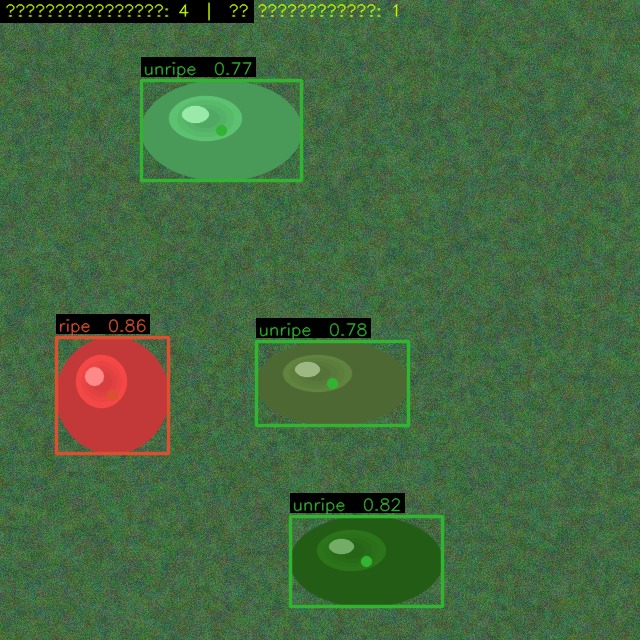
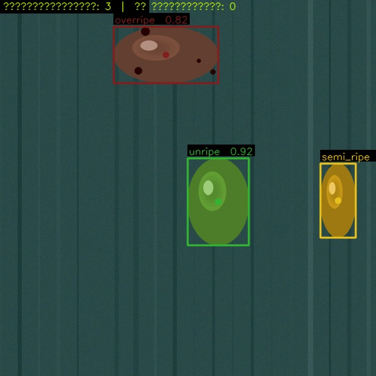
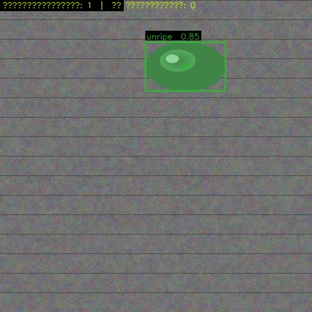
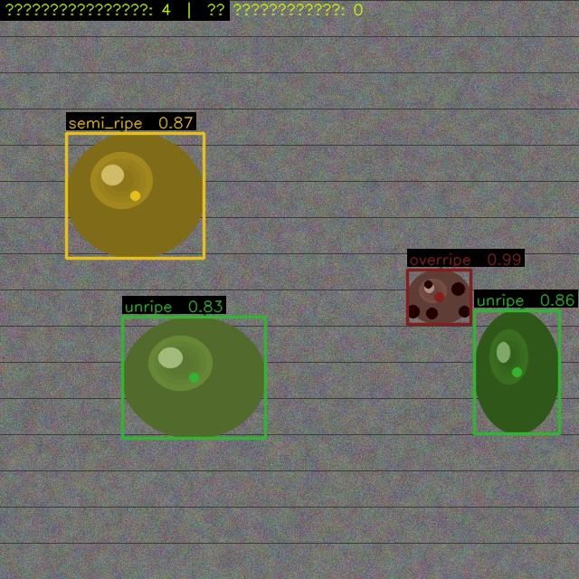
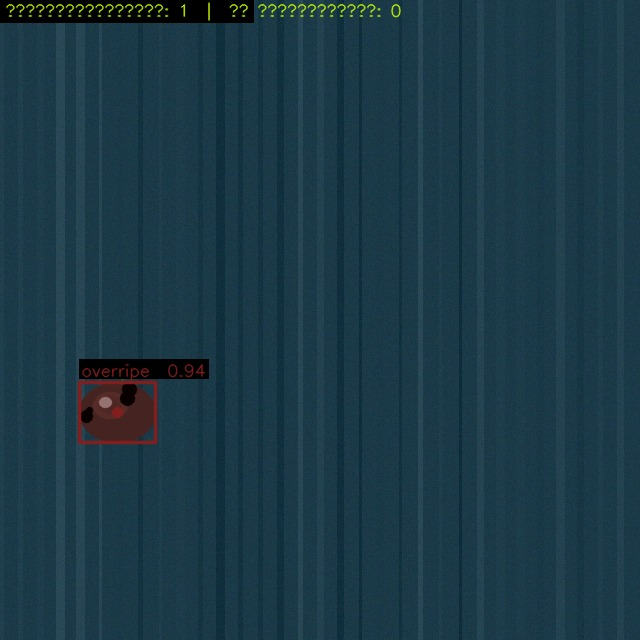

# Cистема детекции зрелости продукции на базе YOLOv8

Интеллектуальный модуль компьютерного зрения (Computer Vision) для автоматического распознавания, классификации степени зрелости плодов и принятия технологических решений манипуляторами агропромышленных комплексов (АПК).

Система спроектирована для работы в сложных производственных условиях: на конвейерных лентах, транспортировочных деревянных поддонах или травяных подстилках.

\---

## ✨ Ключевые особенности

* **Полный цикл разработки:** от процедурной генерации фотореалистичных синтетических данных до инференса в режиме реального времени (Real-time Inference).
* **4-уровневая классификация:** Поддержка классов `unripe` (незрелый), `semi\_ripe` (полузрелый), `ripe` (зрелый), `overripe` (перезрелый).
* **Интегрированная бизнес-логика (Action Mapping):** Автоматическое формирование управляющих директив для контроллеров робота (`ЗАХВАТ`, `ПРОПУСТИТЬ`, `ОТМЕТИТЬ`, `УТИЛИЗАЦИЯ`).
* **Оптимизация приоритета захвата:** Логика детектора автоматически ранжирует цели, выводя спелые плоды (`ripe`) на первое место в конвейере обработки для минимизации задержек манипулятора.
* **Гибкие режимы работы:** Инференс единичных кадров, потоковое видео с камер (с расчетом скользящего FPS) и автономный демонстрационный режим без использования GPU.

\---

## 📊 Примеры работы алгоритма

Модуль включает встроенный генератор окружения, симулирующий физические текстуры и блики. Ниже представлены результаты детекции и разметки на различных типах поверхностей:

|Травяная подстилка (Leaves/Grass)|Деревянный поддон (Pallet)|
|:-:|:-:|
|||

|Конвейерная лента (Conveyor Belt)|Групповая детекция на конвейере|
|:-:|:-:|
|||

|Одиночный перезрелый объект|
|:-:|
||

\---

## ⚙️ Технологический стек и зависимости

Минимальные требования для работы системы зафиксированы в файле `requirements.txt`:

* **`ultralytics>=8.0.0`** — Высокопроизводительный фреймворк компьютерного зрения (YOLOv8)
* **`opencv-python>=4.8.0`** — Обработка изображений и вывод видеопотока
* **`numpy>=1.24.0`** — Матричные вычисления и линейная алгебра

\---

## 🚀 Архитектура и запуск проекта

### 📂 Архитектура репозитория

```text
├── generate\_dataset.py   # Генератор синтетических данных и конфигурации data.yaml
├── train.py              # Скрипт пайплайна обучения нейросети YOLOv8
├── detector.py           # Основной модуль инференса (Фото / Видео / Демо)
├── requirements.txt      # Файл внешних зависимостей проекта
└── README.md             # Документация (текущий файл)
```

### 1\. Подготовка окружения

```bash
# Клонирование репозитория
git clone https://github.com/your\_username/maturity-detector-yolov8.git
cd maturity-detector-yolov8

# Установка зависимостей
pip install -r requirements.txt
```

### 2\. Генерация синтетического датасета

Если у вас нет реального набора размеченных данных, запустите процедурный генератор. Он автоматически создаст сбалансированную выборку в аннотированном формате YOLO и сгенерирует конфигурационный файл `data.yaml`:

```bash
python generate\_dataset.py --output dataset --train 80 --val 20
```

### 3\. Обучение модели

Запустите процесс обучения детектора на сгенерированных данных:

```bash
python train.py --data dataset/data.yaml --epochs 50 --imgsz 640 --batch 16
```

*Все метрики точности (Precision, Recall, mAP), графики потерь (Loss) и наиболее точные веса (`best.pt`) будут сохранены в директорию `results/`.*

### 4\. Инференс и визуализация результатов

**Режим А. Автономный демонстрационный запуск (Без GPU и весов)**
Имитирует работу обученной модели, генерирует 5 контрольных образцов окружения с плодами разной степени зрелости и сохраняет их в виде изображений `demo\_sample\_\*.jpg`:

```bash
python detector.py --demo
```

**Режим Б. Обработка статического изображения:**

```bash
python detector.py --image path/to/image.jpg --weights results/maturity\_detector/weights/best.pt
```

**Режим В. Потоковый инференс с веб-камеры (Real-time):**

```bash
python detector.py --camera 0 --weights results/maturity\_detector/weights/best.pt
```

*(Для выхода из режима трансляции нажмите клавишу `q`)*

\---

## 🤖 Логика интеграции с АПК-манипулятором

Модуль `detector.py` транслирует результаты компьютерного зрения в понятные мехатронным узлам команды:

|Имя класса|Цвет (BGR)|Статус объекта|Команда робота (`action`)|Приоритет|
|-|:-:|-|-|:-:|
|**`unripe`**|Зелёный|Незрелый плод|`ПРОПУСТИТЬ — не готов к уборке`|Низкий|
|**`semi\_ripe`**|Жёлтый|Полузрелый плод|`ОТМЕТИТЬ — уборка через 3–5 дней`|Средний|
|**`ripe`**|Красный|Спелый / Готовый|`ЗАХВАТ — немедленная уборка`|**Высший**|
|**`overripe`**|Бордовый|Перезрелый плод|`УТИЛИЗАЦИЯ — нарушение стандарта`|Средний|

Каждый возвращаемый объект содержит структуру данных `MaturityDetection`:

* `bbox`: Координаты ограничивающей рамки `(x1, y1, x2, y2)` для позиционирования захвата.
* `center`: Точные декартовы координаты центроида `(cx, cy)` объекта для наведения манипулятора.
* `confidence`: Степень уверенности модели нейросети в детекции.
* `action`: Строковая команда-инструкция для управляющего контроллера.

